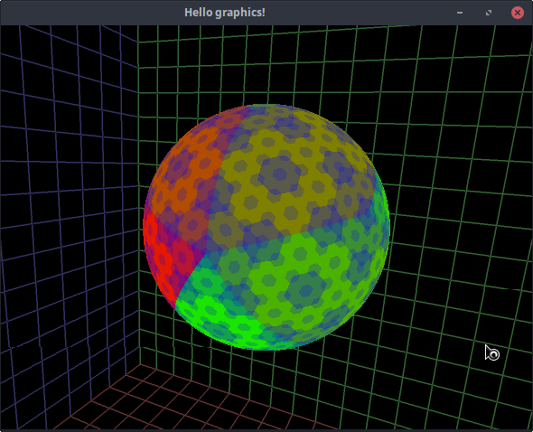
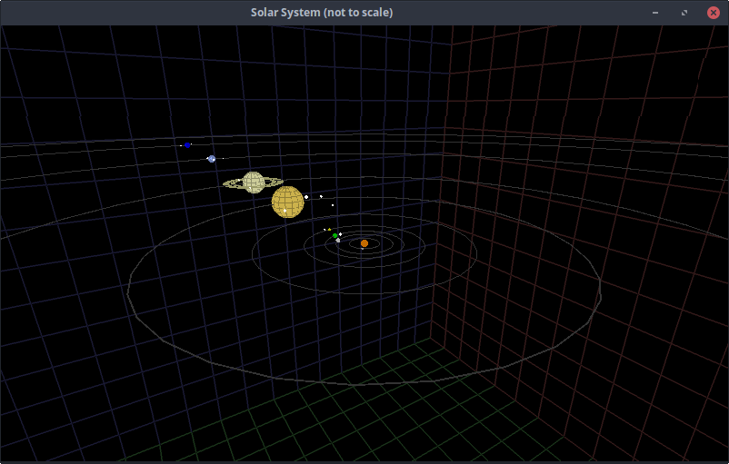
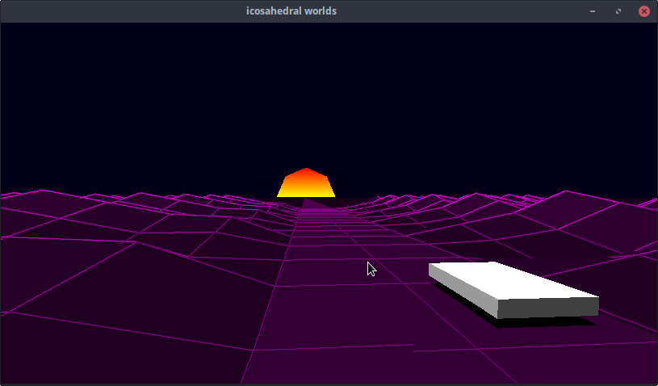

# Icosahedral Worlds
OpenGL project with the eventual goal of generating explorable worlds.

In truth a dumping ground for my graphics projects

## Tesselated Sphere

## Solar System

## /r/Outrun

Currently only targeting OpenGL 2 on linux
